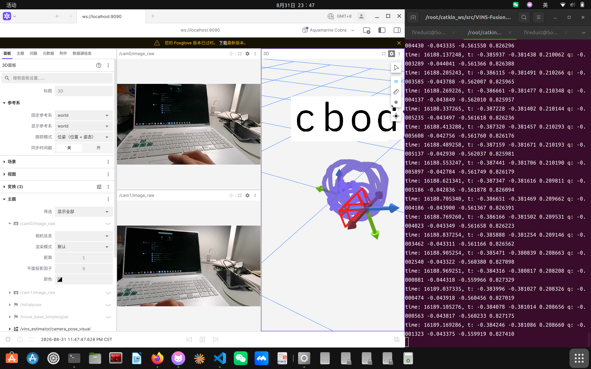

# 2UQ2 + VINS-Fusion 视觉惯性里程计项目

> 项目进展记录（持续更新）｜原版 VINS-Fusion README 见 [README_origin.md](README_origin.md)

## 项目简介

基于 **YLX-2UQ2 双目全局快门相机（内置 6 轴 IMU）** 与 **VINS-Fusion** 的实时视觉惯性里程计（VIO）系统，全部运行在 Docker 容器内，使用 **Foxglove Studio** 进行 Web 可视化。

**当前状态：✅ 实机运行稳定**（绕宿舍一圈并回到起点，见效果图）

---

## 硬件

| 项目 | 规格 |
|---|---|
| 相机 | YLX-2UQ2 双目全局快门，3840×1080 双画面（每眼 1920×1080） |
| 接口 | USB2.0 Type-C，标准 UVC，Linux V4L2 |
| 镜头 | **低畸变广角（实测有效水平 FOV ≈ 86°，非鱼眼）** |
| IMU | 内置 6 轴：±8g / ±2000dps，传感器 800Hz(acc)/400Hz(gyro) |
| IMU 输出 | **UVC XU 扩展单元，15 字节包（3 字节帧序号 + 6 轴×2 字节），帧锁** |
| 稳定设备名 | `/dev/video2uq2`（udev 规则，USB ID 1bcf:0b15） |

**关键实测结论**：
- 当前固件下 IMU 数据**帧锁**（内容变化率 = 序号变化率 = 视频帧率）→ 120fps 模式 IMU ≈ **86Hz**，210fps 模式 ≈ **190Hz**
- 传感器本身 800Hz 上限，厂商称其他客户在 60fps 模式可达 400Hz——**需厂商提供高频固件**才能突破帧锁

---

## 完成的工作

### 1. Docker 环境搭建
- 定制 `docker/Dockerfile`：阿里云 apt 源（xenial EOL 修复）、Ceres 1.12 GitHub 源、集成 rosbridge
- 镜像加速 + Docker 数据目录迁移至 `/home/firedust/docker`
- Foxglove 可视化链路：rosbridge（ws://localhost:9090）→ 桌面版需 `--no-proxy-server`（系统代理 127.0.0.1:7897 拦截 WebSocket）
- 脚本体系：`run_foxglove.sh`（硬件/数据集双模式）、`run_shell.sh`、持久卷 `catkin_ws_vol`

### 2. 数据集验证
- EuRoC `MH_01_easy.bag` 全流程跑通（驱动 → VINS → rosbridge → Foxglove）

### 3. 硬件与 IMU 机制调查
- 探针工具链：`probe`（更新率）、`probe_content`（序号 vs 内容变化率）、`probe_selectors`（XU 枚举）、`probe_switch`（寄存器读写）
- 确认：IMU 数据帧锁、无隐藏高频通道、selector 2/3 为单字节开关

### 4. ROS 驱动 `ylx2uq2_ros`
- V4L2 采集 MJPG 双画面 → 解码 → 双目切分（每眼 1280×720@120）→ 抽帧 30fps
- XU 读 IMU → 上一帧时间戳打点 → `/imu0`（~86Hz）
- 曝光/增益控制、`checker_capture` 双目配对采图节点、`swap_cams` 可配

### 5. 标定（全流程跑通）
| 标定项 | 方法 | 结果 |
|---|---|---|
| 相机内参 | 棋盘格（LaTeX 生成 PDF）→ pinhole 模型 | RMS **0.29px** |
| 双目外参 | `stereo_extrinsics`（OpenCV） | RMS **0.211px**，基线 **59.1mm** |
| IMU↔相机外参 | **Kalibr**（imu-cam 联合标定） | **180° 旋转**（IMU 芯片反装），时延 **-10.8ms**，残差极小 |
| IMU 噪声 | Allan 方差（37min 静止数据） | gyr_n 0.0031 / acc_n 0.0154（参考） |

### 6. IMU 参数调优（A/B 实测结论）
- **标度矩阵弃用**：scale-misalignment 在 66Hz bag 上拟合不可靠（应用后轨迹明显变差），保留原始换算（4096 LSB/g、16.4 LSB/dps）
- **噪声参数**：Allan 纯白噪声值会使 VINS 过度信任 IMU（未校正的系统性标度误差 2~6% 被放大）→ **使用 EuRoC 量级参数（acc_n 0.1 / gyr_n 0.01 / acc_w 0.001 / gyr_w 0.0001）实测最稳**

### 7. 实机运行
- 初始化手法（关键）：**静止 1~2 秒 → 慢速平滑六自由度运动**
- 稳定输出 `/vins_estimator/odometry`、`/vins_estimator/path`

---

## 效果图（绕宿舍实机测试）




---

## 当前最稳配置

```
模式:       2560x720@120fps 双画面（每眼 1280×720），图像抽帧 30fps
IMU:        ~86Hz，原始换算，Kalibr 外参（180°），td = -0.0108
噪声参数:   acc_n 0.1 / gyr_n 0.01 / acc_w 0.001 / gyr_w 0.0001
可视化:     Foxglove ↔ ws://localhost:9090
备选模式:   210fps（每眼 640×480，IMU ~190Hz）→ config/2uq2/*_210.*
```

启动：
```bash
cd docker
./run_foxglove.sh -d /root/catkin_ws/src/VINS-Fusion/config/2uq2/2uq2_stereo_imu_config.yaml
```

---

## 已知限制与后续计划

| 限制 | 说明 | 后续 |
|---|---|---|
| IMU 频率 ~86Hz | 固件帧锁 | 催厂商 400/800Hz 高频固件（需求已整理） |
| 长时间漂移 | VIO 无回环固有 | 开启 `loop_fusion` 回环检测（`brief_k10L6.bin` 已就绪） |
| IMU 系统性标度误差 | 2~6%，未修正 | 用 210fps 高频 bag 重新标定 scale-misalignment |
| 数据集对比 | 仅 EuRoC 验证 | 可用 KITTI 或自录 bag 做定量精度评估 |

---

## 文档索引

- [docs/常用命令.txt](docs/常用命令.txt) — 日常操作速查
- [docs/kalibr标定流程.md](docs/kalibr标定流程.md) — Kalibr 标定全流程（含踩坑记录）
- [tools/](tools/) — 棋盘格、探针、双目外参、Allan 分析等工具
- [kalibr_config/](kalibr_config/) — 标定配置文件与结果
